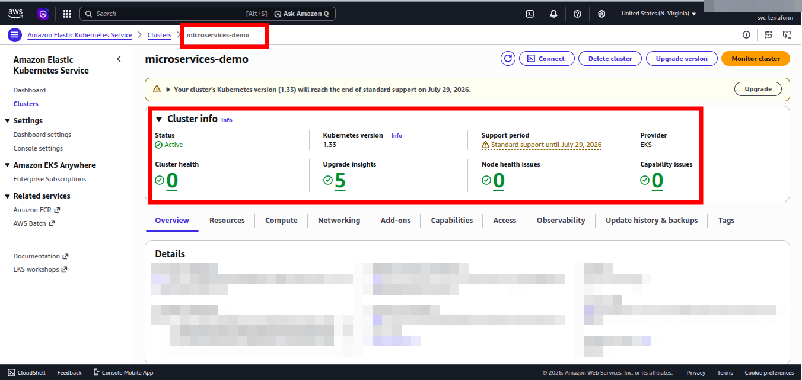
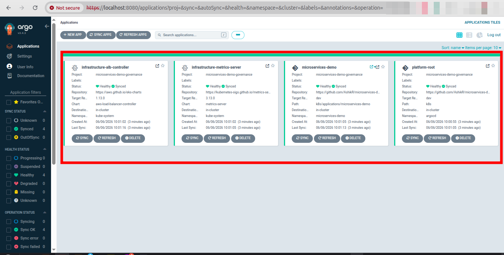
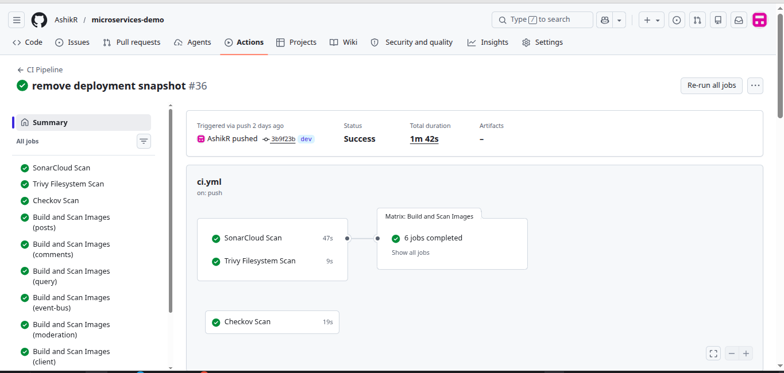
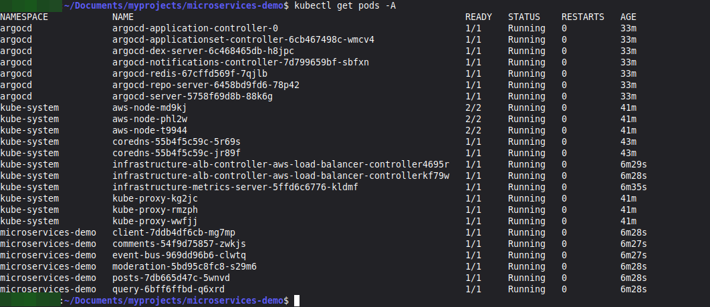
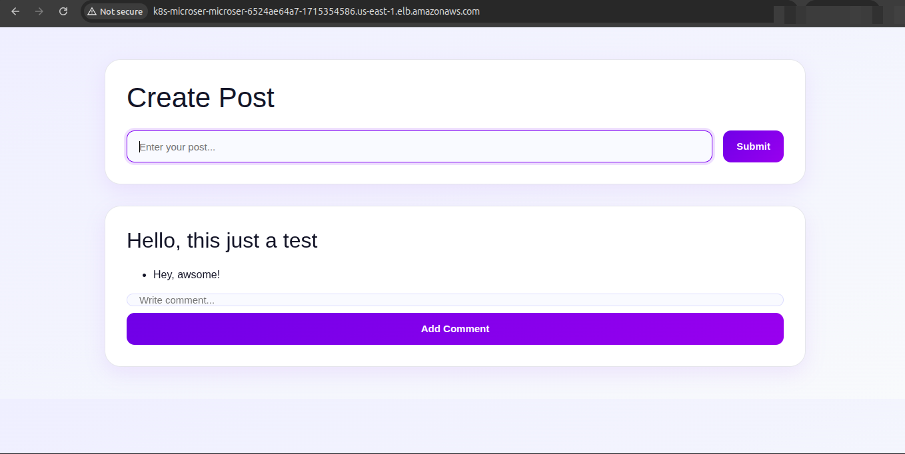

# Cloud-Native Microservices Platform on AWS EKS

## Overview

This project demonstrates the deployment of a cloud-native microservices platform on Amazon EKS using Terraform, Docker, Kubernetes, ArgoCD, GitHub Actions, GitHub OIDC, and IAM Roles for Service Accounts (IRSA).

The goal of this project was to gain hands-on experience with Infrastructure as Code, Kubernetes orchestration, CI/CD automation, GitOps workflows, cloud security, and AWS-native services.

---

## Architecture

```text
Developer
    ↓
GitHub
    ↓
GitHub Actions
    ↓
SonarCloud / Trivy / Checkov
    ↓
Amazon ECR
    ↓
ArgoCD
    ↓
Amazon EKS
    ↓
AWS Application Load Balancer
    ↓
Microservices Application
```

---

## Technology Stack

### Cloud & Infrastructure

- AWS
- Amazon EKS
- Amazon ECR
- VPC
- IAM
- Terraform

### Containerization & Orchestration

- Docker
- Kubernetes

### CI/CD & GitOps

- GitHub Actions
- ArgoCD

### Security & Quality

- GitHub OIDC
- IRSA
- Kubernetes RBAC
- SonarCloud
- Trivy
- Checkov

---

## Application Components

- Client Service (React Frontend)
- Posts Service
- Comments Service
- Query Service
- Moderation Service
- Event Bus Service

---

## Infrastructure Provisioned

Terraform is used to provision:

- VPC
- Public and Private Subnets
- Amazon EKS Cluster
- Managed Node Groups
- Amazon ECR Repositories
- GitHub OIDC Integration
- AWS Load Balancer Controller
- ArgoCD

---

## CI/CD Pipeline

### CI Pipeline

- SonarCloud Code Analysis
- Trivy Filesystem Scan
- Docker Image Build
- Trivy Image Scan
- Checkov Kubernetes Scan

### CD Pipeline

- GitHub OIDC Authentication
- Build Docker Images
- Push Images to Amazon ECR

ArgoCD follows the GitOps model by continuously monitoring Kubernetes manifests stored in Git and synchronizing the cluster state with the desired configuration.

---

## Security

- GitHub OIDC Authentication
- IAM Roles for Service Accounts (IRSA)
- Kubernetes RBAC
- Least-Privilege IAM Permissions
- Container Security Scanning with Trivy

---

## Deployment Flow

1. Provision infrastructure using Terraform.
2. Install ArgoCD and AWS Load Balancer Controller.
3. Bootstrap ArgoCD applications.
4. Push code changes to GitHub.
5. GitHub Actions builds and scans container images.
6. Images are pushed to Amazon ECR.
7. ArgoCD synchronizes workloads to Amazon EKS.

---

## Repository Structure

```text
.github/
└── workflows/

k8s/
├── bootstrap/
├── platform/
└── applications/

terraform/
├── vpc/
├── eks/
├── ecr/
├── github-actions/
├── alb-controller/
└── argocd/

client/
posts/
comments/
query/
moderation/
event-bus/
```

---

## Screenshots

### Amazon EKS Cluster



### ArgoCD Dashboard



### GitHub Actions Pipeline



### Kubernetes Pods



### Application UI



---
